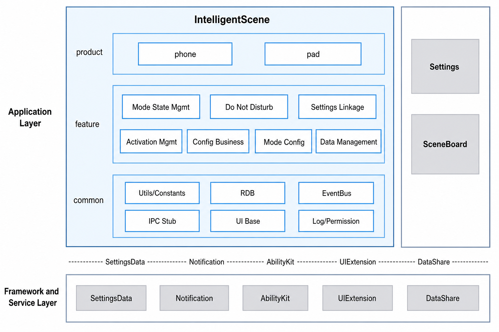

# IntelligentScene

## Introduction

**IntelligentScene** (bundle name: `com.ohos.intelligentscene`) is a pre-installed **system application** in OpenHarmony. It manages notification and incoming-call policies, timed trigger conditions, and linkage with system settings by scenario (Do Not Disturb, Sleep, Study, and more), and adapts to phone and tablet device forms.

This application is a system preset app. IntelligentScene is enabled only when the system parameter `const.intelligentscene.enable=true`. Users can enter through **Settings → IntelligentScene** or the Control Center secondary panel.

### Core Capabilities

**Mode State Management**
- Supports preset modes such as Do Not Disturb, Sleep, and Study, as well as custom modes.
- Uses `StateManager` for mode enable/disable state-machine management and SettingsData sync.

**Do Not Disturb**
- Manages notification DND policies, allowlists for notifications / sound and vibration, contact allow / block lists, repeated callers, and reject-call policies.
- Uses `NotDisturbAdapter` / `NotDisturbTimerManager` for DND / Focus policies and timed triggers.

**Settings Linkage**
- When a mode is enabled, links system settings such as dark mode and handles Live View notifications.
- Uses `SettingLinkageManager` for linkage state-machine management.

**Activation Management**
- Manages rule activation and recommendation enablement to support automatic mode start after conditions are met.

**Config Business**
- Manages local scenes, allow-disturb, contacts, and related business configuration.
- Exposes configuration capabilities through `LocalSceneManager` / `AllowDisturbManager` / `ContactAdapter`.

**Mode Configuration**
- Provides preset-mode defaults and home-page group visibility management.

**Data Management**
- Manages mode / config / contact data models and persists them through RDB.

## Architecture

IntelligentScene uses a layered and modular design organized by product form, business features, and common capabilities, as shown below:


### Application Layer Design

The overall structure is divided into the product layer, feature layer, and common layer:

| Layer | Main Directories / Components | Description |
| ----- | ----------------------------- | ----------- |
| Product | `product` | Phone and tablet forms |
| Feature | `feature/statemanage`, `feature/notdisturb`, `feature/configlinkage`, `feature/activationmanage`, `feature/configmanage`, `feature/modeconfig`, `feature/datamanage` | Mode state management, Do Not Disturb, settings linkage, activation management, config business, mode configuration, data management |
| Common | `common` | Utils/Constants, RDB, EventBus, IPC Stub, UI Base, Log/Permission |

**Feature-layer modules**:

| Capability | Modules | Description |
| ---------- | ------- | ----------- |
| Mode state management | StateManager (`statemanage`) | Mode enable/disable state machine and SettingsData sync |
| Do Not Disturb | NotDisturbAdapter, NotDisturbTimerManager (`notdisturb`) | DND / Focus policies and timed triggers |
| Settings linkage | SettingLinkageManager (`configlinkage`) | System settings linkage and Live View |
| Activation management | ActivationManager (`activationmanage`) | Rule activation and recommendation enablement |
| Config business | LocalSceneManager, AllowDisturbManager, ContactAdapter (`configmanage`) | Local scenes, allow-disturb, contacts, and related business config |
| Mode configuration | ModeConfigAdapter (`modeconfig`) | Preset-mode defaults and home-page group visibility |
| Data management | ModeDataManager, ConfigDataManager (`datamanage`) | Mode / config / contact models and RDB |

### Relationship with Other Applications

| Item | Description |
| ---- | ----------- |
| Can other apps call it? | Yes. `EntryAbility`, `IntelligentSceneUIExtSettingAbility`, `SceneControlUIExtAbility`, `IntelligentSceneServiceExtAbility`, and related components declare `exported=true` and can be launched via Want / UIExtension / Service |
| Who can call | System apps such as Settings and SceneBoard can embed or launch the UI; Service / IPC callers must pass the `PermissionVerifyUtil` allowlist (for example `com.ohos.sceneboard`) or trusted SAs |
| When can it be called | After installation and when `const.intelligentscene.enable=true`; contact / location capabilities require user authorization |
| Supported Want parameters | Settings launches the full configuration pages via entries such as `uri: intelligent_scene_entry`; Control Center launches the secondary panel via UIExtension |
| Cross-process services | `IntelligentSceneServiceExtAbility` and DataShare (`DataExtAbility`) provide resident service and data access; only trusted system processes may call them |

## Build

This project is a multi-module HAP application built with Hvigor. The output is the `com.ohos.intelligentscene` system app package.

### Environment Requirements
- OpenHarmony SDK (`compileSdkVersion` 23; `compatibleSdkVersion` / `targetSdkVersion` 20 in this project)
- DevEco Studio or command-line Hvigor toolchain
- System signing materials (see `signature/`)

### Build Commands

Run from the project root:

```bash
# Open the project in DevEco Studio and Build, or use the hvigor CLI
hvigorw assembleHap
```

## IntelligentScene Development

IntelligentScene is developed in **ArkTS**, with UI based on the ArkUI Stage model. The application uses `product` for Ability entry and pages, the feature layer for mode state, DND, linkage, and related business, and `common` for shared infrastructure. See: [ArkUI Development Overview](https://gitcode.com/openharmony/docs/blob/master/en/application-dev/ui/arkts-ui-development-overview.md)

### Developing on Existing Modules

Typical scenarios: customize existing capabilities, for example adjusting mode enable/disable logic, extending DND policies, modifying Control Center / Settings UI, or optimizing linkage presentation.

Locate the change point by business boundary: `product/phone` (entry and pages), `feature/statemanage` (mode state management), `feature/notdisturb` (Do Not Disturb), `feature/configlinkage` (settings linkage), `feature/activationmanage` (activation management), `feature/configmanage` (config business), `feature/modeconfig` (mode configuration), `feature/datamanage` (data management), or `common` (shared capabilities).

Common modification scenarios:

**Scenario 1: Modify the mode enable/disable path**

- Control Center entry: `product/phone/src/main/ets/pages/controlcenter/ControlCenterPage.ets`
- State machine: `feature/statemanage/src/main/ets/manager/StateManager.ets`
- DND policies: `feature/notdisturb/`

 For example, to add a custom pre-check when enabling a mode, extend `StateManager.startScene()`:
```typescript
 // StateManager.ets — startScene is the mode-enable entry
 public startScene(modeId: string, operType: number, sourceType?: number, updateTime?: number): string {
   // [Add custom pre-check]
   if (!this.customPreCheck(modeId)) {
     return '';
   }

   // Existing flow: state validation → write SettingsData → link DND / system settings
   // ...
 }
```
**Scenario 2: Modify the settings linkage path**

- Linkage management: `feature/configlinkage/src/main/ets/manager/SettingLinkageManager.ets`
- Live View related logic resides in the same module

 For example, to add another system-settings linkage after a mode is enabled, extend `SettingLinkageManager.effectModeLinkedSettings()`:
```typescript
 // SettingLinkageManager.ets — effectModeLinkedSettings applies linkage when a mode takes effect
 public async effectModeLinkedSettings(modeId: string): Promise<void> {
   LogUtil.showInfo(TAG, `effectModeLinkedSettings mode:${modeId}`);
   let darkModeState: SettingsLinkageState = await SystemSettingManager.getSystemSettingByType(modeId,
     ConfigType.SYSTEM_SETTINGS_DARK_MODE);
   this.darkModeStateMachine.convertState(darkModeState);

   let eyeProtectState: SettingsLinkageState = await SystemSettingManager.getSystemSettingByType(modeId,
     ConfigType.SYSTEM_SETTINGS_EYE_PROTECT_MODE);
   this.eyeProtectStateMachine.convertState(eyeProtectState);

   // [Add custom linkage] e.g. convert another system-setting state machine
   // let customState: SettingsLinkageState = await SystemSettingManager.getSystemSettingByType(
   //   modeId, ConfigType.YOUR_CUSTOM_SETTING);
   // this.customStateMachine.convertState(customState);
 }
```
**Scenario 3: Modify configuration / data**

- Preset mode config: `feature/modeconfig/`
- Business config: `feature/configmanage/`
- Data access: `feature/datamanage/`

 For example, to change preset-mode default visibility, update `ModeConfigAdapter.getGroupVisible()`:
```typescript
 // ModeConfigAdapter.ets — getGroupVisible controls whether a home-page group is shown
 public getGroupVisible(modeId: string, groupId: HomeGroupId): boolean {
   const modeConfig: BaseModeConfig = this.getConfigByModeId(modeId);
   if (groupId === HomeGroupId.INTELLIGENT_EXPERIENCE) {
     return false;
   }
   // [Change point] adjust group visibility as needed, e.g. force-show a group
   // if (groupId === HomeGroupId.SYSTEM_FUNCTION) {
   //   return true;
   // }
   return modeConfig.supportGroupIdSet.has(groupId);
 }
```
**Scenario 4: Modify UI components**

- Settings home / mode details: `product/phone/src/main/ets/pages/settinghome/`
- Control Center secondary panel: `product/phone/src/main/ets/pages/controlcenter/`
- DND-related pages: `product/phone/src/main/ets/pages/nodisturb/`
- Common dialogs and list items: `common/src/main/ets/`

 For example, the Control Center page composes the title bar, mode list, and **More settings**:
```typescript
 // ControlCenterPage.ets — Control Center secondary panel composition
 @Component
 struct ControlCenterPage {
   build() {
     Column() {
       TitleBarComponent({ /* props */ })
       ModeListComponent({ /* props */ })
       BottomButtonComponent({
         onButtonClick: () => {
           this.jumpSettings();
         },
       })
     }
   }
 }
```
Common entry points:

| Target | Path |
| ------ | ---- |
| Settings home / mode list | `product/phone/src/main/ets/pages/settinghome/` |
| Control Center secondary panel | `product/phone/src/main/ets/pages/controlcenter/` |
| DND / notification policy UI | `product/phone/src/main/ets/pages/nodisturb/` |
| Mode state management | `feature/statemanage/` |
| Do Not Disturb | `feature/notdisturb/` |
| Settings linkage | `feature/configlinkage/` |
| Activation management | `feature/activationmanage/` |
| Config business | `feature/configmanage/` |
| Mode configuration | `feature/modeconfig/` |
| Data management | `feature/datamanage/` |
| Caller allowlist | `common/src/main/ets/utils/PermissionVerifyUtil.ets` |

### Developing New Feature Capabilities

Typical scenarios: add IntelligentScene-related capabilities, extend Ability / Extension, add differentiated interaction, or adapt new device forms.

> **Note**: The current project uses a `product + feature + common` multi-module structure, with the product entry mainly in `product/phone`. New capabilities are usually extended within the existing layers. If a new product-form HAP is added, create the corresponding directory under `product/` and register it in `build-profile.json5`.

**Step 1: Extend business capabilities (most common)**

1. Extend logic in the corresponding feature module, for example:
   - Mode state management → `feature/statemanage`
   - Do Not Disturb → `feature/notdisturb`
   - Settings linkage → `feature/configlinkage`
   - Activation management → `feature/activationmanage`
   - Config business → `feature/configmanage`
   - Mode configuration → `feature/modeconfig`
   - Data management → `feature/datamanage`
2. To add a new HAR, create a module under `feature/` and register dependencies in `build-profile.json5` and `product/phone/oh-package.json5`.
3. Integrate the new capability from pages or Abilities in `product/phone`.

**Step 2: Configure / verify Ability entry**

Entries are already declared in `product/phone/src/main/module.json5`. When extending capabilities, usually only verify that permissions, Ability, and Extension configuration meet the new scenario:

```json
{
  "module": {
    "name": "phone",
    "type": "entry",
    "mainElement": "EntryAbility",
    "deviceTypes": [
      "default",
      "tablet"
    ],
    "abilities": [
      {
        "name": "EntryAbility",
        "srcEntry": "./ets/entryability/EntryAbility.ets",
        "exported": true
      }
    ],
    "extensionAbilities": [
      {
        "name": "IntelligentSceneUIExtSettingAbility",
        "srcEntry": "./ets/entryability/IntelligentSceneUIExtSettingAbility.ets",
        "type": "sys/commonUI"
      },
      {
        "name": "SceneControlUIExtAbility",
        "srcEntry": "./ets/entryability/SceneControlUIExtAbility.ets",
        "type": "sys/commonUI"
      },
      {
        "name": "IntelligentSceneServiceExtAbility",
        "srcEntry": "./ets/serviceability/IntelligentSceneServiceExtAbility.ets",
        "type": "service"
      }
    ]
  }
}
```

**Step 3: Customize UI**

After business capability and Ability configuration are ready, extend Settings pages, Control Center pages, or DND pages using the UI modification approach in the previous section.

To add a new page:
1. Add the page file under `product/phone/src/main/ets/pages/`;
2. Register it in `resources/base/profile/main_pages.json` if system routing is required;
3. Launch it from the corresponding Ability / Navigation / Want route.

## Directory
```text
intellligentscene7.0
├─AppScope                              # App-level config and i18n resources
│  ├─app.json5                          # bundleName, version, etc.
│  └─resources/                         # Global strings / icons
├─common                                # Common capability layer
│  └─src/main/ets/
│     ├─basecomponent/                  # Shared UI components
│     ├─constant/                       # Business constants
│     ├─framework/                      # EventBus, routing, and framework helpers
│     ├─rdbstore/                       # RDB access
│     ├─utils/                          # Logging, permission verification, Ability utils
│     └─stub/                           # IPC Stub infrastructure
├─feature                               # Feature layer
│  ├─statemanage/                       # Mode state management
│  ├─notdisturb/                        # Do Not Disturb
│  ├─configlinkage/                     # Settings linkage
│  ├─activationmanage/                  # Activation management
│  ├─configmanage/                      # Config business
│  ├─modeconfig/                        # Mode configuration
│  └─datamanage/                        # Data management
├─product                               # Product layer
│  └─phone/                             # Phone / tablet HAP
│     └─src/main/ets/
│        ├─entryability/                # UIAbility / UIExtension
│        ├─serviceability/              # Service / DataShare
│        ├─pages/                       # Settings home, Control Center, DND, etc.
│        ├─stub/                        # IPC Stub implementations
│        └─subscriber/                  # Static subscribers
├─docs/figures/                         # Architecture figures
├─hvigor                                # Build tool configuration
├─signature                             # Signing certificates and profile
├─build-profile.json5                   # Project-level SDK / signing / product config
├─build.sh
├─oh-package.json5
├─OAT.xml                               # Open-source compliance audit
├─LICENSE
├─README.md                             # English documentation
└─README_zh.md                          # Chinese documentation
```

## Constraints
- **Language**: ArkTS
- **Runtime form**: system preinstalled app (`com.ohos.intelligentscene`), depends on SettingsData, Notification, and system settings capabilities
- **Device types**: phone, tablet (see `product/phone/src/main/module.json5`)
- **Feature switch**: `const.intelligentscene.enable` must be enabled
- **Permissions**: main permissions required by IntelligentScene are as follows (see `product/phone/src/main/module.json5`)

  | Permission | Grant mode | Usage |
  | ---------- | ---------- | ----- |
  | ohos.permission.ACCESS_SYSTEM_SETTINGS | system | Read/write system settings / SettingsData |
  | ohos.permission.MANAGE_SETTINGS | system | Manage system settings |
  | ohos.permission.MANAGE_SECURE_SETTINGS | system | Manage secure settings |
  | ohos.permission.NOTIFICATION_CONTROLLER | system | Notification DND policy control |
  | ohos.permission.GET_BUNDLE_INFO | system | Get app package info |
  | ohos.permission.GET_INSTALLED_BUNDLE_LIST | system | Get installed app list |
  | ohos.permission.READ_CONTACTS | user | Contact allow / block policies |
  | ohos.permission.LOCATION | user | Location-based trigger conditions |
  | ohos.permission.READ_WHOLE_CALENDAR | user | Calendar / schedule conditions |
  | ohos.permission.START_ABILITIES_FROM_BACKGROUND | system | Launch Ability from background |
  | ohos.permission.START_INVISIBLE_ABILITY | system | Start invisible components (such as Settings) |
  | ohos.permission.START_SYSTEM_DIALOG | system | Launch system dialogs |
  | ohos.permission.RUNNING_LOCK | system | Background running lock |

- **External calls**: Service / IPC is allowed only for allowlisted bundle names or trusted SAs
- **Form adaptation**: phone / tablet layouts differ; cover multi-form validation when changing UI

## Contributing

Contributions of code and documentation are welcome. See [Contributing](https://gitcode.com/openharmony/docs/blob/master/en/contribute/contribution.md).

## Related Repositories

- [applications_settings](https://gitcode.com/openharmony/applications_settings) (Settings app; hosts the IntelligentScene settings entry)
- [window_scene_board](https://gitcode.com/openharmony-sig/window_scene_board) (SceneBoard; Control Center host)
- [arkui_ace_engine](https://gitcode.com/openharmony/arkui_ace_engine)
