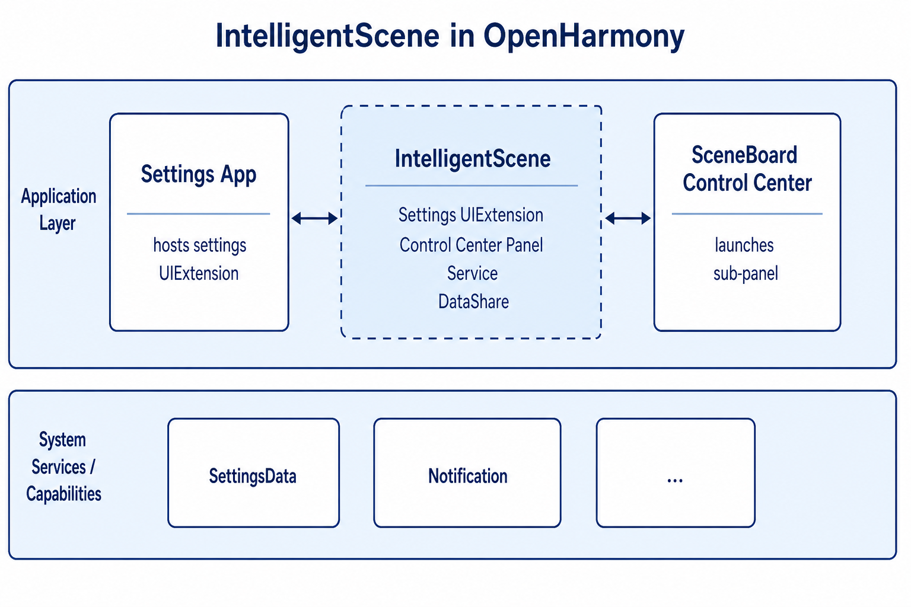
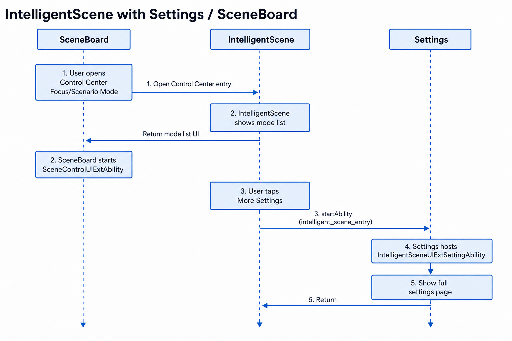
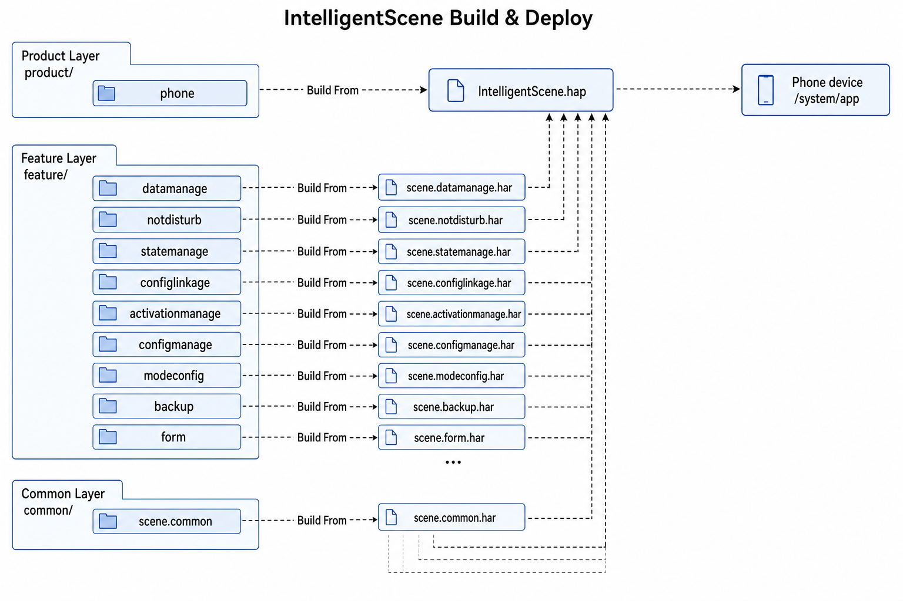

# IntelligentScene

## Introduction

**IntelligentScene** (bundle name: `com.ohos.intelligentscene`) is the **scenario-mode system application** in the OpenHarmony desktop subsystem. It manages notification and incoming-call policies, timed trigger conditions, and linkage with system settings by scenario (Do Not Disturb, Sleep, Study, and more), and provides embeddable UI and service capabilities for the **Settings** app and the **Control Center (SceneBoard)**.

This is a system preinstalled app. IntelligentScene is enabled only when the system parameter `const.intelligentscene.enable=true`. Users can enter through **Settings → IntelligentScene** or the Control Center secondary panel.

### Core Capabilities

**Mode and policy management**
- Supports preset modes such as Do Not Disturb, Sleep, and Study, as well as custom modes.
- Manages Do Not Disturb notification policies, allowlists for notifications / sound and vibration, contact allow / block lists, repeated callers, and reject-call policies.

**Full configuration in Settings**
- Embeds into Settings through `IntelligentSceneUIExtSettingAbility` (`sys/commonUI`), providing mode list, detail configuration, conditions, notifications, and related pages.
- Supports in-Settings search navigation (`intelligent_scene_entry`) and sub-page callbacks.

**Quick switching in Control Center**
- Provides a Control Center secondary panel through `SceneControlUIExtAbility` for mode on/off and temporary duration.
- **More settings** jumps to the IntelligentScene entry in the Settings app.

**System service and linkage**
- `IntelligentSceneServiceExtAbility` runs as a resident service and initializes the mode state machine and settings-linkage state machine.
- When a mode is enabled, it can link system settings such as dark mode, eye comfort, power saving, and screen-off.

> **Note**: This repository is the IntelligentScene **application layer**. Notification / SettingsData and other underlying capabilities are provided by system services; this app owns mode state, UI interaction, policy orchestration, and integration with Settings / SceneBoard.

### Relationship with Settings / SceneBoard

IntelligentScene depends on Settings and SceneBoard for entry hosting and Control Center presentation; it does not implement the Settings or Control Center container itself.

**Event and call flow**:
1. Settings embeds `IntelligentSceneUIExtSettingAbility` via UIExtension; search and **More settings** both use `intelligent_scene_entry`.
2. SceneBoard, as the Control Center host, launches `SceneControlUIExtAbility`; the secondary panel notifies Control Center to close via `sendData`.
3. External Service / IPC calls must pass the `PermissionVerifyUtil` allowlist (including bundle names such as `com.ohos.sceneboard`).

> Example: Control Center **More settings** navigation:
> - The user opens the IntelligentScene secondary panel from SceneBoard Control Center.
> - IntelligentScene shows the mode list through `SceneControlUIExtAbility`.
> - Tapping **More settings** calls `startAbility` to launch Settings with `uri: intelligent_scene_entry`.
> - Settings then embeds `IntelligentSceneUIExtSettingAbility` to show the full settings pages.

## Architecture

IntelligentScene uses a layered and modular design and works with Settings, SceneBoard, and system services.

### System Positioning

IntelligentScene sits in the application layer, providing scenario-mode UI and business capabilities to Settings / SceneBoard, and uses SettingsData, Notification, and other system capabilities for policy execution.



### Layered Design

The project is divided into the product layer (Ability entry), feature layer (scenario-mode business), and common layer (utils / RDB / IPC infrastructure), as shown below:


| Layer | Main directories / components | Description |
| ---- | ----------------------------- | ----------- |
| Product / app entry | `product/phone/`, `entryability/`, `serviceability/` | UIAbility, UIExtension, ServiceExtension lifecycle and page entry |
| Feature / scenario-mode business | `feature/statemanage`, `feature/notdisturb`, `feature/configlinkage`, etc. | Mode state machine, DND policies, settings linkage, activation, data management |
| Common / basic capabilities | `common/` | Logging, SettingsData, permission verification, EventBus, RDB, IPC Stub, UI infrastructure |

### Ability and UI Scenarios

Settings embedding, Control Center secondary panel, standalone entry, and related scenarios are handled by different Ability / Extension components:



**Data flow overview**:

```text
User / Settings / SceneBoard
  → UIExtension / startAbility (intelligent_scene_entry)
  → EntryAbility / IntelligentSceneUIExtSettingAbility / SceneControlUIExtAbility
  → StateManager / SettingLinkageManager / NotDisturb
  → SettingsData / Notification
  → IntelligentSceneServiceExtAbility (IPC / resident service)
```

### Components and External Dependencies

Internally organized as common / feature / product, IntelligentScene collaborates with Settings, SceneBoard, and system services through UIExtension, ServiceExtension, and DataShare. Settings owns settings navigation and entry hosting; SceneBoard owns the Control Center container; IntelligentScene owns scenario-mode business UI, data, and policy execution.

### Module Description

| Module | Path | Description |
| ---- | ---- | ---- |
| Common | common/ | @ohos/scene.common: utils, constants, RDB, EventBus, Stub, UI infrastructure |
| Data management | feature/datamanage | Mode/config/contact/allow-disturb models and RDB |
| Mode configuration | feature/modeconfig | Preset-mode defaults and home-page group visibility |
| Config business management | feature/configmanage | Local scenes, allow-disturb, contacts, preload, and more |
| Do Not Disturb | feature/notdisturb | DND/Focus policies and timers |
| State management | feature/statemanage | Current-mode state machine: enable/disable and settingsdata sync |
| Settings linkage | feature/configlinkage | Linkage with system settings and live views |
| Backup / restore | feature/backup | Backup/restore and legacy DND migration |
| Intent adapters | feature/intent | Insight Intent adapters (integrate as needed) |
| Phone product | product/phone | Entry, pages, resources; builds the IntelligentScene HAP |

## Build

This project is a layered HAR + HAP project built with Hvigor. The output is the `com.ohos.intelligentscene` system app package, deployed to `/system/app` on the device.



### Environment Requirements
- OpenHarmony SDK (`compileSdkVersion` 23; `compatibleSdkVersion` / `targetSdkVersion` 20 in this project)
- DevEco Studio or command-line Hvigor toolchain
- System signing materials (see `signature/`)

### Build Commands

Run from the project root:

```bash
# Open the project in DevEco Studio and build, or use the project script
./build.sh
```

When integrated into the OpenHarmony source tree as a system component, follow the platform build process to package this app as a preinstalled system application.

### Inter-module Dependencies

Each module declares dependencies in `oh-package.json5`. For example, the Phone product `product/phone/oh-package.json5`:

```json
{
  "name": "phone",
  "dependencies": {
    "@ohos/scene.common": "file:../../common",
    "@ohos/scene.modeconfig": "file:../../feature/modeconfig",
    "@ohos/scene.notdisturb": "file:../../feature/notdisturb",
    "@ohos/scene.configmanage": "file:../../feature/configmanage",
    "@ohos/scene.datamanage": "file:../../feature/datamanage",
    "@ohos/scene.statemanage": "file:../../feature/statemanage",
    "@ohos/scene.activationmanage": "file:../../feature/activationmanage",
    "@ohos/scene.configlinkage": "file:../../feature/configlinkage",
    "@ohos/scene.backup": "file:../../feature/backup",
    "@ohos/scene.form": "file:../../feature/form"
  }
}
```

## IntelligentScene Development

IntelligentScene is developed in **ArkTS**, with UI based on the ArkUI Stage model. It embeds into Settings / SceneBoard through UIExtension and keeps mode state alive through ServiceExtension. See: [ArkUI Development Overview](https://gitcode.com/openharmony/docs/blob/master/en/application-dev/ui/arkts-ui-development-overview.md)

### Developing on Existing Modules

Typical scenarios: customize existing capabilities, for example trimming or adjusting feature modules, modifying UI interaction, or changing Settings / Control Center integration logic.

**Adjust or trim an existing module**

1. Identify the target area by business boundary: `feature/` (state machine, DND, linkage, etc.), `product/phone/src/main/ets/pages/` (UI), or `common/` (utils, Stub).
2. When integrating features:
    - Exported APIs are declared by the `main` field in `{module path}/oh-package.json5` (usually `Index.ets`).
    - The product layer declares dependencies in `product/phone/oh-package.json5` and `build-profile.json5`.
3. When trimming a feature:
    - Remove the module dependency from `oh-package.json5` / `build-profile.json5` first;
    - Then clean up all product-layer calls to that module's APIs.

For example, `feature/notdisturb/oh-package.json5` declares the API entry:

```json
{
  "name": "@ohos/scene.notdisturb",
  "main": "index.ets",
  "dependencies": {
    "@ohos/scene.common": "file:../../common"
  }
}
```

When the Phone product integrates this feature, add it in `product/phone/oh-package.json5`:

```json
{
  "dependencies": {
    "@ohos/scene.notdisturb": "file:../../feature/notdisturb"
  }
}
```

**Modify existing UI**

Examples for customizing the settings pages or Control Center secondary panel:
- Settings embedding entry: `IntelligentSceneUIExtSettingAbility`; Control Center entry: `SceneControlUIExtAbility`.
- Settings home and mode details: `pages/settinghome/`; Control Center: `pages/controlcenter/`; DND-related UI: `pages/nodisturb/`.
- Extend existing pages or add new presentation branches by mode type as needed.

```typescript
// ControlCenterPage: compose title bar, mode list, and More settings
@Component
struct ControlCenterPage {
  build() {
    Column() {
      // ...

      // CustomUI, optional custom extension area
      // CustomUI(...)

      // Existing component: title bar
      TitleBarComponent({ /* props */ })
      // Existing component: mode list
      ModeListComponent({ /* props */ })
      // Existing component: More settings button
      BottomButtonComponent({
        onButtonClick: () => {
          this.jumpSettings();
        },
      })

      // ...
    }
  }
}
```

Common entry points:

| Target | Path |
| --- | --- |
| Settings home / mode list | `product/phone/src/main/ets/pages/settinghome/` |
| Control Center secondary panel | `product/phone/src/main/ets/pages/controlcenter/` |
| DND / notification policies | `product/phone/src/main/ets/pages/nodisturb/`, `feature/notdisturb/` |
| Mode state / linkage | `feature/statemanage/`, `feature/configlinkage/` |
| Caller allowlist | `common/src/main/ets/utils/PermissionVerifyUtil.ets` |

### New Features or Product Capabilities

Typical scenarios: add a new feature HAR, extend Ability/Extension, or add differentiated interaction capabilities.

> **Note**: The current project uses `product/phone` as the main HAP (`com.ohos.intelligentscene`). New capabilities are usually added as modules within the existing HAR + HAP structure. If Pad / PC product forms are split later, add new directories under `product/`.

**Step 1: Extend feature modules (most common)**

1. Add or extend a HAR module under `feature/` and register it in `build-profile.json5`.
2. Integrate the dependency in `product/phone/oh-package.json5`.
3. Call the feature module APIs from product-layer pages or managers.

Register the new module in `build-profile.json5`:

```json
{
  "modules": [
    {
      "name": "scene.notdisturb",
      "srcPath": "./feature/notdisturb"
    }
  ]
}
```

Integrate the dependency in `product/phone/oh-package.json5`:

```json
{
  "dependencies": {
    "@ohos/scene.notdisturb": "file:../../feature/notdisturb"
  }
}
```

**Step 2: Configure / verify Ability entry**

When extending capabilities, verify that Ability / Extension, permissions, and `requestPermissions` in `product/phone/src/main/module.json5` meet the new scenario. If launching invisible components is involved, update the signing profile ACL as well.

Entries are already declared in `module.json5`; when extending capabilities, usually only verify that the configuration meets the new scenario:

```json
{
  "module": {
    "name": "phone",
    "type": "entry",
    "mainElement": "EntryAbility",
    "abilities": [
      {
        "name": "EntryAbility",
        "srcEntry": "./ets/entryability/EntryAbility.ets",
        "exported": true
      }
    ],
    "extensionAbilities": [
      {
        "name": "IntelligentSceneUIExtSettingAbility",
        "srcEntry": "./ets/entryability/IntelligentSceneUIExtSettingAbility.ets",
        "type": "sys/commonUI"
      },
      {
        "name": "SceneControlUIExtAbility",
        "srcEntry": "./ets/entryability/SceneControlUIExtAbility.ets",
        "type": "sys/commonUI"
      },
      {
        "name": "IntelligentSceneServiceExtAbility",
        "srcEntry": "./ets/serviceability/IntelligentSceneServiceExtAbility.ets",
        "type": "service"
      }
    ]
  }
}
```

**Step 3: Customize UI**

After feature integration and Ability configuration, extend the corresponding `pages/` directories as described in **Modify existing UI** above.

To add a new page:
1. Add the page file under `product/phone/src/main/ets/pages/`;
2. Register it in `resources/base/profile/main_pages.json` if needed;
3. Launch it from the corresponding Ability / Navigation by business scenario.

Example page file (e.g. `pages/custom/CustomFeaturePage.ets`):

```typescript
@Entry
@Component
struct CustomFeaturePage {
  build() {
    Column() {
      Text('Custom Feature Page')
        .fontSize(20)
      // CustomUI(...)
    }
    .width('100%')
    .height('100%')
  }
}
```

Register in `main_pages.json`:

```json
{
  "src": [
    "pages/settinghome/HomeWindowSettings",
    "pages/controlcenter/ControlCenterPage",
    "pages/custom/CustomFeaturePage"
  ]
}
```

Launch from the route map by business scenario (see `PageRouteController`):

```typescript
const PAGE_PATH_MAP: Map<string, string> = new Map([
  // ...
  ['custom_feature_entry', '../../pages/custom/CustomFeaturePage'],
]);

// Navigation / business entry jumps by key:
// pagePath = PAGE_PATH_MAP.get('custom_feature_entry')
```

## Directory

```text
intellligentscene7.0
├─AppScope                              # App-level config and i18n resources
│  ├─app.json5                          # bundleName, version, etc.
│  └─resources/                         # Global strings and resources
├─common                                # Common layer (@ohos/scene.common)
├─docs
│  └─figures/                           # Architecture figures
│     ├─intelligentscene_in_os.png      # System positioning (Chinese)
│     ├─IntelligentScene.png            # Layered architecture (Chinese)
│     ├─intelligentscene_relation.png   # Ability and UI scenarios (Chinese)
│     ├─IntelligentScene_build_from.png # Build and deploy (Chinese)
│     ├─intelligentscene_in_os_en.png   # System positioning (English)
│     ├─IntelligentScene_en.png         # Layered architecture (English)
│     ├─intelligentscene_relation_en.png# Ability and UI scenarios (English)
│     └─IntelligentScene_build_from_en.png # Build and deploy (English)
├─feature                               # Feature-layer HAR modules
│  ├─configlinkage/                     # System settings linkage
│  ├─configmanage/                      # Config and preload management
│  ├─datamanage/                        # Data models and RDB
│  ├─intent/                            # Insight Intent adapters
│  ├─modeconfig/                        # Preset mode configuration
│  ├─notdisturb/                        # DND policies and timers
│  └─statemanage/                       # Mode state machine
├─product
│  └─phone/                             # Phone product HAP
│     └─src/main/ets/
│        ├─entryability/                # UIAbility / UIExtension
│        ├─serviceability/              # Service / Backup / DataShare
│        ├─pages/                       # Settings home, Control Center, DND, etc.
│        ├─stub/                        # IPC Stub
│        ├─widget/                      # Widgets
│        └─subscriber/                  # Static subscribers
├─scripts/                              # Helper scripts (e.g. i18n sync)
├─signature/                            # Signing certificates and profile
├─hvigor/                               # Build tool configuration
├─build-profile.json5                   # Project-level SDK / signing / product config
├─build.sh
├─oh-package.json5
├─LICENSE
├─README.md
└─README_zh.md
```

## Constraints

- Language: ArkTS
- Runtime form: system preinstalled app (`com.ohos.intelligentscene`), depends on SettingsData, Notification, and privileged system permissions
- Feature switch: `const.intelligentscene.enable` must be enabled
- Runtime OS: OpenHarmony (`runtimeOS: OpenHarmony` in the project config)
- System-app signing: release signature and profile must match the bundle name; privileged permissions must be declared in the profile ACL
- External calls: Service/IPC is allowed only for allowlisted bundle names or SAs

## Contributing

Contributions of code and documentation are welcome. See [Contributing](https://gitcode.com/openharmony/docs/blob/master/en/contribute/contribution.md).

## Related Repositories

- [applications_settings](https://gitcode.com/openharmony/applications_settings) (Settings app; hosts the IntelligentScene settings entry)
- [window_scene_board](https://gitcode.com/openharmony-sig/window_scene_board) (SceneBoard; Control Center host)
- [arkui_ace_engine](https://gitcode.com/openharmony/arkui_ace_engine)
