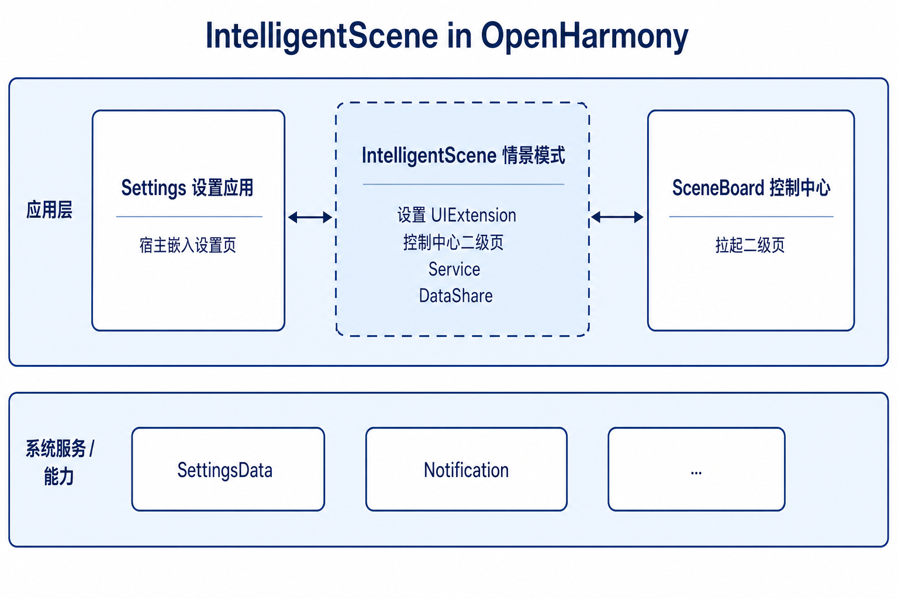
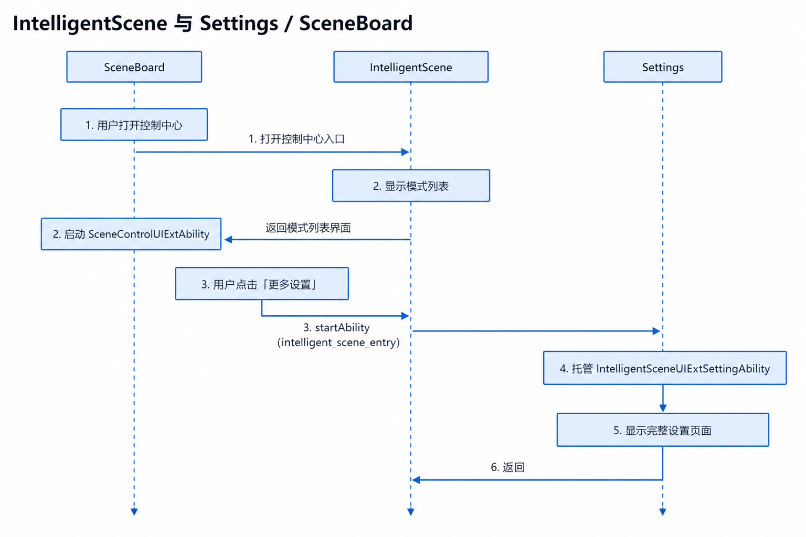
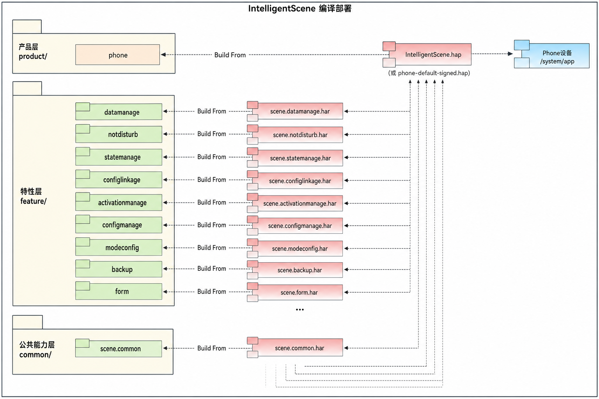

# IntelligentScene（情景模式）

## 简介

**IntelligentScene（情景模式）**（包名：`com.ohos.intelligentscene`）是 OpenHarmony 大桌面子系统的 **情景模式系统应用**，按场景（免打扰、睡眠、学习等）统一管理通知与来电策略、定时触发条件，以及与系统设置项的联动，并向 **设置应用**、**控制中心（SceneBoard）** 提供可嵌入的 UI 与对外服务能力。

本应用为系统预置应用，需通过系统参数 `const.intelligentscene.enable=true` 开启后相关能力才会生效。用户可通过「设置 → 情景模式」或控制中心二级页进入。

### 核心能力

**模式与策略管理**
- 支持预置模式：免打扰、睡眠、学习等，并支持自定义模式。
- 管理通知勿扰策略、允许通知/声音振动白名单、联系人允许/拦截、重复来电、拒接等来电策略。

**设置侧完整配置**
- 通过 `IntelligentSceneUIExtSettingAbility`（`sys/commonUI`）嵌入设置应用，提供模式列表、详情配置、条件与通知等完整设置页。
- 支持设置内搜索跳转（`intelligent_scene_entry`）及二级页回传。

**控制中心快速切换**
- 通过 `SceneControlUIExtAbility` 提供控制中心二级页，支持模式开/关与1小时、2小时等临时开启。
- 「更多设置」可跳转至设置应用中的情景模式入口。

**系统服务与联动**
- `IntelligentSceneServiceExtAbility` 作为常驻服务，初始化模式状态机与设置联动状态机。
- 模式开启后联动深色模式系统设置项。

> **说明**：本仓定位为情景模式 **应用层**。Notification / SettingsData等底层能力由系统服务提供；本应用负责模式状态、UI 交互、策略编排及与 Settings / SceneBoard 的集成。

### IntelligentScene 与 Settings / SceneBoard 的关系

IntelligentScene 依赖设置应用与 SceneBoard 完成入口承载与控制中心展示，本身不包含 Settings / 控制中心容器实现。

**事件与调用关系上**：
1. Settings 通过 UIExtension 嵌入 `IntelligentSceneUIExtSettingAbility`；搜索与「更多设置」均跳转 `intelligent_scene_entry`。
2. SceneBoard 作为控制中心宿主拉起 `SceneControlUIExtAbility`；二级页关闭通过 `sendData` 通知控制中心。
3. 对外 Service / IPC 调用需通过 `PermissionVerifyUtil` 白名单校验（含 `com.ohos.sceneboard` 等包名）。

> 例如，控制中心「更多设置」跳转过程：
> - 用户在 SceneBoard 控制中心打开情景模式二级页；
> - IntelligentScene 通过 `SceneControlUIExtAbility` 展示模式列表；
> - 点击「更多设置」后 `startAbility` 拉起 Settings，并携带 `uri: intelligent_scene_entry`；
> - Settings 再嵌入 `IntelligentSceneUIExtSettingAbility`，展示完整设置页。

## 架构说明

IntelligentScene 采用分层与模块化设计，并与 Settings、SceneBoard 及系统服务协同工作。

### 在系统中的定位

IntelligentScene 位于应用层，向 Settings / SceneBoard 提供情景模式 UI 与业务能力，并通过 TelephonyKit 之外的 SettingsData、Notification等系统能力完成策略执行。



### 分层设计

整体可划分为产品层（Ability 入口）、特性层（情景模式业务能力）、公共层（工具 / RDB / IPC 基建），如图：


| 层次 | 主要目录 / 组件 | 说明 |
| ---- | --------------- | ---- |
| 产品层 / 应用入口 | `product/phone/`、`entryability/`、`serviceability/` | UIAbility、UIExtension、ServiceExtension 生命周期与页面入口 |
| 特性层 / 情景模式业务 | `feature/statemanage`、`feature/notdisturb`、`feature/configlinkage` 等 | 模式状态机、勿扰策略、设置联动、激活管理、数据管理 |
| 公共层 / 基础能力 | `common/` | 日志、SettingsData、权限校验、EventBus、RDB、IPC Stub、UI 基建 |

### Ability 与 UI 场景

Settings 嵌入、控制中心二级页、独立入口等场景由不同 Ability / Extension 承载：



**数据流概览**：

```text
用户 / Settings / SceneBoard
  → UIExtension / startAbility（intelligent_scene_entry）
  → EntryAbility / IntelligentSceneUIExtSettingAbility / SceneControlUIExtAbility
  → StateManager / SettingLinkageManager / NotDisturb
  → SettingsData / Notification
  → IntelligentSceneServiceExtAbility（IPC / 常驻保活）
```

### 部件与外部依赖

部件内部按 common / feature / product 组织，通过 UIExtension、ServiceExtension、DataShare 与 Settings、SceneBoard 及系统服务完成跨进程协作。Settings 负责设置导航与入口承载；SceneBoard 负责控制中心容器；IntelligentScene 负责模式业务 UI、数据与策略执行。

### 模块说明

| 模块 | 路径 | 说明 |
| ---- | ---- | ---- |
| 公共能力 | common/ | @ohos/scene.common：工具、常量、RDB、EventBus、Stub、UI 基建 |
| 数据管理 | feature/datamanage | 模式/配置/联系人/允许打扰等数据模型与 RDB |
| 模式配置 | feature/modeconfig | 预置模式默认配置与首页分组可见性 |
| 配置业务管理 | feature/configmanage | 本地场景、允许打扰、联系人、预加载等 |
| 免打扰 | feature/notdisturb | 勿扰/Focus 策略、定时器 |
| 状态管理 | feature/statemanage | 当前模式状态机：启停、settingsdata 同步 |
| 设置联动 | feature/configlinkage | 模式与系统设置项联动及实况通知 |
| 备份恢复 | feature/backup | 备份恢复与旧版免打扰数据迁移 |
| Intent 适配 | feature/intent | Insight Intent 适配（按需集成） |
| Phone 产品 | product/phone | 入口、页面、资源；产物为 IntelligentScene HAP |

## 编译构建

本工程为分层 HAR + HAP 工程，使用 Hvigor 构建，产物为 `com.ohos.intelligentscene` 系统应用包，部署到设备 `/system/app`。



### 环境要求
- OpenHarmony SDK（本工程 `compileSdkVersion` 为 23，`compatibleSdkVersion` / `targetSdkVersion` 为 20）
- DevEco Studio 或命令行 Hvigor 工具链
- 系统签名证书（见 `signature/`）

### 编译命令

在工程根目录执行：

```bash
# 使用 DevEco Studio 打开工程后执行 Build，或使用工程脚本
./build.sh
```

若作为 OpenHarmony 系统部件合入源码树，可参考平台统一构建方式，将本应用作为预置系统应用打包进镜像。

### 模块间依赖

各模块通过 `oh-package.json5` 声明依赖。例如 Phone 产品 `product/phone/oh-package.json5`：

```json
{
  "name": "phone",
  "dependencies": {
    "@ohos/scene.common": "file:../../common",
    "@ohos/scene.modeconfig": "file:../../feature/modeconfig",
    "@ohos/scene.notdisturb": "file:../../feature/notdisturb",
    "@ohos/scene.configmanage": "file:../../feature/configmanage",
    "@ohos/scene.datamanage": "file:../../feature/datamanage",
    "@ohos/scene.statemanage": "file:../../feature/statemanage",
    "@ohos/scene.activationmanage": "file:../../feature/activationmanage",
    "@ohos/scene.configlinkage": "file:../../feature/configlinkage",
    "@ohos/scene.backup": "file:../../feature/backup",
    "@ohos/scene.form": "file:../../feature/form"
  }
}
```

## IntelligentScene 开发

IntelligentScene 采用 **ArkTS** 语言开发，UI 基于 ArkUI Stage 模型，通过 UIExtension 嵌入 Settings / SceneBoard，通过 ServiceExtension 保活模式状态。可开发参考：[ArkUI 开发概述](https://gitcode.com/openharmony/docs/blob/master/zh-cn/application-dev/ui/arkts-ui-development-overview.md)

### 基于已有模块的开发

适用场景：对已有能力做功能定制，例如裁剪/调整既有特性模块、修改 UI 交互、调整控制中心或设置嵌入逻辑等。

**对已有模块的功能调整与裁剪**

1. 明确改动落点：按业务边界定位到 `feature/`（状态机、勿扰、联动等）、`product/phone/src/main/ets/pages/`（UI）或 `common/`（工具、Stub）。
2. 调整特性集成时：
    - 模块接口导出位于 `{模块路径}/oh-package.json5` 的 `main` 字段（通常为 `Index.ets`）。
    - 产品层在 `product/phone/oh-package.json5` 与 `build-profile.json5` 中声明依赖。
3. 裁剪某特性时：
    - 先移除 `oh-package.json5` / `build-profile.json5` 中的模块依赖；
    - 再清理产品层对该模块 API 的全部调用。

例如，`feature/notdisturb/oh-package.json5` 中声明接口导出：

```json
{
  "name": "@ohos/scene.notdisturb",
  "main": "index.ets",
  "dependencies": {
    "@ohos/scene.common": "file:../../common"
  }
}
```

Phone 产品集成该特性时，在 `product/phone/oh-package.json5` 中增加：

```json
{
  "dependencies": {
    "@ohos/scene.notdisturb": "file:../../feature/notdisturb"
  }
}
```

**对已有 UI 进行修改**

以定制设置页或控制中心二级页举例：
- 设置嵌入入口为 `IntelligentSceneUIExtSettingAbility`，控制中心入口为 `SceneControlUIExtAbility`。
- 设置首页、模式详情等由 `pages/settinghome/` 承载；控制中心由 `pages/controlcenter/` 承载；免打扰相关由 `pages/nodisturb/` 承载。
- 开发过程中可在既有页面中扩展组件，或按模式类型增加新的展示分支。

```typescript
// ControlCenterPage：组合标题栏、模式列表与「更多设置」
@Component
struct ControlCenterPage {
  build() {
    Column() {
      // ...

      // CustomUI，自定义扩展区域
      // CustomUI(...)

      // 引入已有组件：标题栏
      TitleBarComponent({ /* props */ })
      // 引入已有组件：模式列表
      ModeListComponent({ /* props */ })
      // 引入已有组件：「更多设置」按钮
      BottomButtonComponent({
        onButtonClick: () => {
          this.jumpSettings();
        },
      })

      // ...
    }
  }
}
```

常用修改入口：

| 目标 | 路径 |
| --- | --- |
| 设置首页 / 模式列表 | `product/phone/src/main/ets/pages/settinghome/` |
| 控制中心二级页 | `product/phone/src/main/ets/pages/controlcenter/` |
| 免打扰 / 通知策略 | `product/phone/src/main/ets/pages/nodisturb/`、`feature/notdisturb/` |
| 模式状态 / 联动 | `feature/statemanage/`、`feature/configlinkage/` |
| 调用方白名单 | `common/src/main/ets/utils/PermissionVerifyUtil.ets` |

### 新特性或产品能力的开发

适用场景：新增特性 HAR、扩展新的 Ability/Extension、补充差异化交互能力。

> **说明**：当前工程以 `product/phone` 为主 HAP（`com.ohos.intelligentscene`）。新能力一般在现有 HAR + HAP 内按模块扩展；若后续拆分 Pad / PC 等产品形态，可再新增 `product/` 子目录。

**步骤1：扩展特性模块（最常见）**

1. 在 `feature/` 下新增或扩展 HAR 模块，并在 `build-profile.json5` 注册。
2. 在 `product/phone/oh-package.json5` 中集成依赖。
3. 由产品层页面或 Manager 调用特性模块导出接口。

在 `build-profile.json5` 中注册新模块：

```json
{
  "modules": [
    {
      "name": "scene.notdisturb",
      "srcPath": "./feature/notdisturb"
    }
  ]
}
```

在 `product/phone/oh-package.json5` 中集成依赖：

```json
{
  "dependencies": {
    "@ohos/scene.notdisturb": "file:../../feature/notdisturb"
  }
}
```

**步骤2：配置 / 确认 Ability 入口**

扩展能力时通常需确认 `product/phone/src/main/module.json5` 中 Ability / Extension、权限与 `requestPermissions` 是否满足新场景。涉及启动不可见组件时，需同步更新签名 profile ACL。

本工程入口已在 `module.json5` 中声明，扩展能力时通常只需确认配置是否满足新场景：

```json
{
  "module": {
    "name": "phone",
    "type": "entry",
    "mainElement": "EntryAbility",
    "abilities": [
      {
        "name": "EntryAbility",
        "srcEntry": "./ets/entryability/EntryAbility.ets",
        "exported": true
      }
    ],
    "extensionAbilities": [
      {
        "name": "IntelligentSceneUIExtSettingAbility",
        "srcEntry": "./ets/entryability/IntelligentSceneUIExtSettingAbility.ets",
        "type": "sys/commonUI"
      },
      {
        "name": "SceneControlUIExtAbility",
        "srcEntry": "./ets/entryability/SceneControlUIExtAbility.ets",
        "type": "sys/commonUI"
      },
      {
        "name": "IntelligentSceneServiceExtAbility",
        "srcEntry": "./ets/serviceability/IntelligentSceneServiceExtAbility.ets",
        "type": "service"
      }
    ]
  }
}
```

**步骤3：定制 UI**

在完成特性集成与 Ability 配置后，按上一节「对已有 UI 进行修改」扩展对应 `pages/` 目录即可。

若需新增独立页面：
1. 在 `product/phone/src/main/ets/pages/` 下新增页面文件；
2. 在 `resources/base/profile/main_pages.json` 中注册（如需要）；
3. 由对应 Ability / Navigation 按业务场景拉起。

新增页面文件示例（如 `pages/custom/CustomFeaturePage.ets`）：

```typescript
@Entry
@Component
struct CustomFeaturePage {
  build() {
    Column() {
      Text('Custom Feature Page')
        .fontSize(20)
      // CustomUI(...)
    }
    .width('100%')
    .height('100%')
  }
}
```

在 `main_pages.json` 中注册：

```json
{
  "src": [
    "pages/settinghome/HomeWindowSettings",
    "pages/controlcenter/ControlCenterPage",
    "pages/custom/CustomFeaturePage"
  ]
}
```

在路由表中按业务场景拉起（参考 `PageRouteController`）：

```typescript
const PAGE_PATH_MAP: Map<string, string> = new Map([
  // ...
  ['custom_feature_entry', '../../pages/custom/CustomFeaturePage'],
]);

// Navigation / 业务入口按 key 跳转：
// pagePath = PAGE_PATH_MAP.get('custom_feature_entry')
```

## 目录

```text
intellligentscene7.0
├─AppScope                              # 应用级配置与多语言资源
│  ├─app.json5                          # bundleName、版本号等
│  └─resources/                         # 全局 string 等资源
├─common                                # 公共能力层（@ohos/scene.common）
├─docs
│  └─figures/                           # 架构图
│     ├─intelligentscene_in_os.png      # 系统中定位（中文）
│     ├─IntelligentScene.png            # 分层架构（中文）
│     ├─intelligentscene_relation.png     # Ability 与 UI 场景（中文）
│     ├─IntelligentScene_build_from.png # 编译部署（中文）
│     ├─intelligentscene_in_os_en.png   # 系统中定位（英文）
│     ├─IntelligentScene_en.png         # 分层架构（英文）
│     ├─intelligentscene_relation_en.png# Ability 与 UI 场景（英文）
│     └─IntelligentScene_build_from_en.png # 编译部署（英文）
├─feature                               # 特性层 HAR
│  ├─configlinkage/                     # 系统设置联动
│  ├─configmanage/                      # 配置与预加载
│  ├─datamanage/                        # 数据模型与 RDB
│  ├─intent/                            # Insight Intent 适配
│  ├─modeconfig/                        # 预置模式配置
│  ├─notdisturb/                        # 免打扰策略与定时
│  └─statemanage/                       # 模式状态机
├─product
│  └─phone/                             # Phone 产品 HAP
│     └─src/main/ets/
│        ├─entryability/                # UIAbility / UIExtension
│        ├─serviceability/              # Service / Backup / DataShare
│        ├─pages/                       # 设置首页、控制中心、免打扰等
│        ├─stub/                        # IPC Stub
│        ├─widget/                      # 卡片
│        └─subscriber/                  # 静态订阅者
├─scripts/                              # 辅助脚本（如多语言同步）
├─signature/                            # 签名证书与 profile
├─hvigor/                               # 构建工具配置
├─build-profile.json5                   # 工程级 SDK / 签名 / product 配置
├─build.sh
├─oh-package.json5
├─LICENSE
├─README.md
└─README_zh.md
```

## 约束

- 语言版本：ArkTS
- 运行形态：系统预置应用（`com.ohos.intelligentscene`），依赖 SettingsData、Notification 及系统特权权限
- 特性开关：需开启 `const.intelligentscene.enable`
- 运行环境：OpenHarmony（工程配置 `runtimeOS: OpenHarmony`）
- 系统应用签名：release 签名与 profile 需匹配包名，特权权限需在 profile ACL 中声明
- 对外调用：Service/IPC 仅允许白名单内包名或 SA 调用

## 参与贡献

欢迎广大开发者贡献代码、文档等，具体的贡献流程和方式请参见[参与贡献](https://gitcode.com/openharmony/docs/blob/master/zh-cn/contribute/%E5%8F%82%E4%B8%8E%E8%B4%A1%E7%8C%AE.md)。

## 相关仓

- [applications_settings](https://gitcode.com/openharmony/applications_settings)（设置应用，情景模式设置入口宿主）
- [window_scene_board](https://gitcode.com/openharmony-sig/window_scene_board)（SceneBoard，控制中心宿主）
- [arkui_ace_engine](https://gitcode.com/openharmony/arkui_ace_engine)
