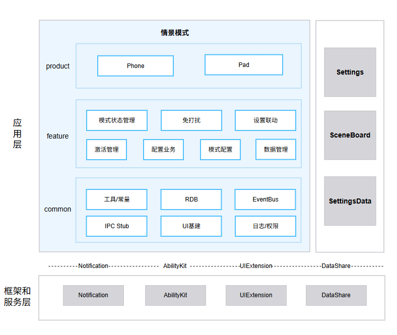

# 情景模式（IntelligentScene）

## 简介

**情景模式**（包名：`com.ohos.intelligentscene`）是 OpenHarmony 中预置的 **系统应用**，按场景（免打扰、睡眠、学习等）统一管理通知与来电策略、定时触发条件，以及与系统设置项的联动，并适配手机、平板设备形态。

本应用为系统预置应用，需通过系统参数 `const.intelligentscene.enable=true` 开启后相关能力才会生效。用户可通过「设置 → 情景模式」或控制中心二级页进入。

### 核心能力

**模式状态管理**
- 支持预置模式：免打扰、睡眠、学习等，并支持自定义模式。
- 通过 `StateManager` 完成模式启停状态机管理，并同步写入 SettingsData。

**免打扰**
- 管理通知勿扰策略、允许通知 / 声音振动白名单、联系人允许 / 拦截、重复来电、拒接等来电策略。
- 通过 `NotDisturbAdapter` / `NotDisturbTimerManager` 完成勿扰 / Focus 策略与定时触发。

**设置联动**
- 模式开启后联动系统设置项（如深色模式等），并处理实况通知。
- 通过 `SettingLinkageManager` 完成联动状态机管理。

**激活管理**
- 管理规则激活与推荐生效，支撑条件触发后的模式自动开启。

**配置业务**
- 管理本地场景、允许打扰、联系人等业务配置。
- 通过 `LocalSceneManager` / `AllowDisturbManager` / `ContactAdapter` 对外提供配置能力。

**模式配置**
- 提供预置模式默认配置与首页分组可见性管理。

**数据管理**
- 管理模式 / 配置 / 联系人等数据模型，并通过 RDB 持久化。

## 架构说明

情景模式采用分层与模块化设计，按产品形态、业务特性与公共能力组织代码，如图：


### 应用层分层设计

整体可划分为产品层、特性层、公共层：

| 层次 | 主要目录 / 组件 | 说明 |
|------| -------------- |------|
| 产品层 | `product` | 支持手机、平板形态 |
| 特性层 | `feature/statemanage`、`feature/notdisturb`、`feature/configlinkage`、`feature/activationmanage`、`feature/configmanage`、`feature/modeconfig`、`feature/datamanage` | 模式状态管理、免打扰、设置联动、激活管理、配置业务、模式配置、数据管理 |
| 公共层 | `common` | 工具/常量、RDB、EventBus、IPC Stub、UI基建、日志/权限 |

**特性层模块说明**：

| 核心能力 | 模块 | 说明 |
|--------|------|------|
| 模式状态管理 | StateManager（`statemanage`） | 模式启停状态机、SettingsData 同步 |
| 免打扰 | NotDisturbAdapter、NotDisturbTimerManager（`notdisturb`） | 勿扰 / Focus 策略、定时触发 |
| 设置联动 | SettingLinkageManager（`configlinkage`） | 系统设置项联动、实况通知 |
| 激活管理 | ActivationManager（`activationmanage`） | 规则激活、推荐生效 |
| 配置业务 | LocalSceneManager、AllowDisturbManager、ContactAdapter（`configmanage`） | 本地场景、允许打扰、联系人等业务配置 |
| 模式配置 | ModeConfigAdapter（`modeconfig`） | 预置模式默认配置与首页分组可见性 |
| 数据管理 | ModeDataManager、ConfigDataManager（`datamanage`） | 模式 / 配置 / 联系人等数据模型与 RDB |

### 与其他应用的关系

| 项目 | 说明 |
|------|------|
| 是否允许其他应用调用 | 允许。`EntryAbility`、`IntelligentSceneUIExtSettingAbility`、`SceneControlUIExtAbility`、`IntelligentSceneServiceExtAbility` 等声明 `exported=true`，外部可通过 Want / UIExtension / Service 拉起 |
| 谁能调用 | Settings、SceneBoard 等系统应用可嵌入或拉起 UI；Service / IPC 调用方需通过 `PermissionVerifyUtil` 白名单（如 `com.ohos.sceneboard`）或受信 SA |
| 什么时候能调用 | 应用安装且 `const.intelligentscene.enable=true` 后可调用；涉及联系人、定位等能力需用户授权后方可执行 |
| 支持的 Want 参数 | 设置侧通过 `uri: intelligent_scene_entry` 等入口拉起完整配置页；控制中心通过 UIExtension 拉起二级页 |
| 跨进程服务 | 通过 `IntelligentSceneServiceExtAbility`、DataShare（`DataExtAbility`）提供常驻服务与数据访问，仅系统内部受信进程可调用 |

## 编译构建

本工程为多模块 HAP 应用工程，使用 Hvigor 构建，产物为 `com.ohos.intelligentscene` 系统应用包。

### 环境要求
- OpenHarmony SDK（本工程 `compileSdkVersion` 为 23，`compatibleSdkVersion` / `targetSdkVersion` 为 20）
- DevEco Studio 或命令行 Hvigor 工具链
- 系统签名证书（见 `signature/`）

### 编译命令

在工程根目录执行：

```bash
# 使用 DevEco Studio 打开工程后执行 Build，或使用 hvigor 命令行
hvigorw assembleHap
```

## 情景模式开发

情景模式采用 **ArkTS** 语言开发，UI 基于 ArkUI Stage 模型。应用通过 `product` 承载 Ability 入口与页面，通过特性层完成模式状态、免打扰、联动等业务，并通过 `common` 提供公共基建。开发可参考：[ArkUI 开发概述](https://gitcode.com/openharmony/docs/blob/master/zh-cn/application-dev/ui/arkts-ui-development-overview.md)

### 基于已有模块的开发

适用场景：对已有能力做功能定制，例如调整模式启停逻辑、扩展勿扰策略、修改控制中心 / 设置页交互、优化联动展示等。

明确改动点：按业务边界定位到 product/phone（入口与页面）、feature/statemanage（模式状态管理）、feature/notdisturb（免打扰）、feature/configlinkage（设置联动）、feature/activationmanage（激活管理）、feature/configmanage（配置业务）、feature/modeconfig（模式配置）、feature/datamanage（数据管理）或 common（公共能力）。

以下列举一些常见的修改场景：

**场景1：修改模式启停链路**

- 控制中心入口位于 `product/phone/src/main/ets/pages/controlcenter/ControlCenterPage.ets`
- 状态机位于 `feature/statemanage/src/main/ets/manager/StateManager.ets`
- 勿扰策略位于 `feature/notdisturb/`

 例如，需在模式开启时新增自定义前置检查，可在 `StateManager.startScene()` 中添加相关逻辑：
```typescript
 // StateManager.ets — startScene 是模式开启流程入口
 public startScene(modeId: string, operType: number, sourceType?: number, updateTime?: number): string {
   // 【新增自定义前置检查】
   if (!this.customPreCheck(modeId)) {
     return '';
   }

   // 原有流程：状态校验 → 写入 SettingsData → 联动勿扰 / 系统设置
   // ...
 }
```
**场景2：修改设置联动链路**

- 联动管理位于 `feature/configlinkage/src/main/ets/manager/SettingLinkageManager.ets`
- 实况通知相关能力位于同模块的 LiveView 管理逻辑中

 例如，需在模式开启后补充一项系统设置联动，可在 `SettingLinkageManager.effectModeLinkedSettings()` 中扩展：
```typescript
 // SettingLinkageManager.ets — effectModeLinkedSettings 在模式生效时应用联动设置
 public async effectModeLinkedSettings(modeId: string): Promise<void> {
   LogUtil.showInfo(TAG, `effectModeLinkedSettings mode:${modeId}`);
   let darkModeState: SettingsLinkageState = await SystemSettingManager.getSystemSettingByType(modeId,
     ConfigType.SYSTEM_SETTINGS_DARK_MODE);
   this.darkModeStateMachine.convertState(darkModeState);

   let eyeProtectState: SettingsLinkageState = await SystemSettingManager.getSystemSettingByType(modeId,
     ConfigType.SYSTEM_SETTINGS_EYE_PROTECT_MODE);
   this.eyeProtectStateMachine.convertState(eyeProtectState);

   // 【新增自定义联动】例如扩展一项系统设置联动状态机转换
   // let customState: SettingsLinkageState = await SystemSettingManager.getSystemSettingByType(
   //   modeId, ConfigType.YOUR_CUSTOM_SETTING);
   // this.customStateMachine.convertState(customState);
 }
```
**场景3：修改配置 / 数据**

- 预置模式配置位于 `feature/modeconfig/`
- 业务配置位于 `feature/configmanage/`
- 数据访问位于 `feature/datamanage/`

 例如，若需调整预置模式默认可见性，可在 `ModeConfigAdapter.getGroupVisible()` 中修改：
```typescript
 // ModeConfigAdapter.ets — getGroupVisible 控制首页分组是否展示
 public getGroupVisible(modeId: string, groupId: HomeGroupId): boolean {
   const modeConfig: BaseModeConfig = this.getConfigByModeId(modeId);
   if (groupId === HomeGroupId.INTELLIGENT_EXPERIENCE) {
     return false;
   }
   // 【修改点】按业务需要调整分组可见性，例如强制显示某分组
   // if (groupId === HomeGroupId.SYSTEM_FUNCTION) {
   //   return true;
   // }
   return modeConfig.supportGroupIdSet.has(groupId);
 }
```
**场景4：修改UI组件**

- 设置首页、模式详情位于 `product/phone/src/main/ets/pages/settinghome/`
- 控制中心二级页位于 `product/phone/src/main/ets/pages/controlcenter/`
- 免打扰相关页面位于 `product/phone/src/main/ets/pages/nodisturb/`
- 通用弹框、列表项等位于 `common/src/main/ets/`

 例如，控制中心页面组合标题栏、模式列表与「更多设置」：
```typescript
 // ControlCenterPage.ets — 控制中心二级页组合
 @Component
 struct ControlCenterPage {
   build() {
     Column() {
       TitleBarComponent({ /* props */ })
       ModeListComponent({ /* props */ })
       BottomButtonComponent({
         onButtonClick: () => {
           this.jumpSettings();
         },
       })
     }
   }
 }
```
常用修改入口：

| 目标 | 路径 |
|------|------|
| 设置首页 / 模式列表 | `product/phone/src/main/ets/pages/settinghome/` |
| 控制中心二级页 | `product/phone/src/main/ets/pages/controlcenter/` |
| 免打扰 / 通知策略 UI | `product/phone/src/main/ets/pages/nodisturb/` |
| 模式状态管理 | `feature/statemanage/` |
| 免打扰 | `feature/notdisturb/` |
| 设置联动 | `feature/configlinkage/` |
| 激活管理 | `feature/activationmanage/` |
| 配置业务 | `feature/configmanage/` |
| 模式配置 | `feature/modeconfig/` |
| 数据管理 | `feature/datamanage/` |
| 调用方白名单 | `common/src/main/ets/utils/PermissionVerifyUtil.ets` |

### 新特性能力的开发

适用场景：新增情景模式相关能力、扩展 Ability / Extension、补充差异化交互或适配新设备形态。

> **说明**：当前工程采用 `product + feature + common` 多模块结构，产品入口主要在 `product/phone`。新能力一般按现有分层扩展；若新增产品形态 HAP，可在 `product/` 下增加对应目录并在 `build-profile.json5` 中注册。

**步骤1：扩展业务能力（最常见）**

1. 在特性层对应模块中补充逻辑，例如：
   - 模式状态管理 → `feature/statemanage`
   - 免打扰 → `feature/notdisturb`
   - 设置联动 → `feature/configlinkage`
   - 激活管理 → `feature/activationmanage`
   - 配置业务 → `feature/configmanage`
   - 模式配置 → `feature/modeconfig`
   - 数据管理 → `feature/datamanage`
2. 如需新增独立 HAR，在 `feature/` 下创建模块，并在 `build-profile.json5` 与 `product/phone/oh-package.json5` 中注册依赖。
3. 在 `product/phone` 的页面或 Ability 中接入新能力。

**步骤2：配置 / 确认 Ability 入口**

本工程入口已在 `product/phone/src/main/module.json5` 中声明，扩展能力时通常只需确认权限、Ability、Extension 配置是否满足新场景：

```json
{
  "module": {
    "name": "phone",
    "type": "entry",
    "mainElement": "EntryAbility",
    "deviceTypes": [
      "default",
      "tablet"
    ],
    "abilities": [
      {
        "name": "EntryAbility",
        "srcEntry": "./ets/entryability/EntryAbility.ets",
        "exported": true
      }
    ],
    "extensionAbilities": [
      {
        "name": "IntelligentSceneUIExtSettingAbility",
        "srcEntry": "./ets/entryability/IntelligentSceneUIExtSettingAbility.ets",
        "type": "sys/commonUI"
      },
      {
        "name": "SceneControlUIExtAbility",
        "srcEntry": "./ets/entryability/SceneControlUIExtAbility.ets",
        "type": "sys/commonUI"
      },
      {
        "name": "IntelligentSceneServiceExtAbility",
        "srcEntry": "./ets/serviceability/IntelligentSceneServiceExtAbility.ets",
        "type": "service"
      }
    ]
  }
}
```

**步骤3：定制 UI**

在完成业务能力与 Ability 配置后，按上一节对「已有模块的功能修改与裁剪」中的 UI 组件修改方式扩展设置页、控制中心页或免打扰页即可。

若需新增独立页面：
1. 在 `product/phone/src/main/ets/pages/` 下新增页面文件；
2. 如需系统路由注册，在 `resources/base/profile/main_pages.json` 中声明；
3. 由对应 Ability / Navigation / Want 路由拉起。

## 目录
```text
intellligentscene7.0
├─AppScope                              # 应用级配置与多语言资源
│  ├─app.json5                          # bundleName、版本号等
│  └─resources/                         # 全局字符串 / 图标等资源
├─common                                # 公共能力层
│  └─src/main/ets/
│     ├─basecomponent/                  # 通用 UI 组件
│     ├─constant/                       # 业务常量
│     ├─framework/                      # EventBus、路由等框架能力
│     ├─rdbstore/                       # RDB 访问
│     ├─utils/                          # 日志、权限校验、Ability 工具等
│     └─stub/                           # IPC Stub 基建
├─feature                               # 特性层
│  ├─statemanage/                       # 模式状态管理
│  ├─notdisturb/                        # 免打扰
│  ├─configlinkage/                     # 设置联动
│  ├─activationmanage/                  # 激活管理
│  ├─configmanage/                      # 配置业务
│  ├─modeconfig/                        # 模式配置
│  └─datamanage/                        # 数据管理
├─product                               # 产品层
│  └─phone/                             # 手机 / 平板形态 HAP
│     └─src/main/ets/
│        ├─entryability/                # UIAbility / UIExtension
│        ├─serviceability/              # Service / DataShare
│        ├─pages/                       # 设置首页、控制中心、免打扰等
│        ├─stub/                        # IPC Stub 实现
│        └─subscriber/                  # 静态订阅者
├─docs/figures/                         # 架构图
├─hvigor                                # 构建工具配置
├─signature                             # 签名证书与 profile
├─build-profile.json5                   # 工程级 SDK / 签名 / product 配置
├─build.sh
├─oh-package.json5
├─OAT.xml                               # 开源合规审计
├─LICENSE
├─README.md                             # 英文说明文档
└─README_zh.md                          # 中文说明文档
```

## 约束
- **语言版本**：ArkTS
- **运行形态**：系统预置应用（`com.ohos.intelligentscene`），依赖 SettingsData、Notification、系统设置等系统能力
- **设备类型**：`手机`、`平板`（见 `product/phone/src/main/module.json5`）
- **特性开关**：需开启 `const.intelligentscene.enable`
- **权限**：情景模式所需的主要权限如下（见 `product/phone/src/main/module.json5`）

  | 权限 | 授权方式 | 使用场景 |
  |------|---------|--------|
  | ohos.permission.ACCESS_SYSTEM_SETTINGS | 系统授权 | 读写系统设置 / SettingsData |
  | ohos.permission.MANAGE_SETTINGS | 系统授权 | 管理系统设置项 |
  | ohos.permission.MANAGE_SECURE_SETTINGS | 系统授权 | 管理安全设置项 |
  | ohos.permission.NOTIFICATION_CONTROLLER | 系统授权 | 通知勿扰策略控制 |
  | ohos.permission.GET_BUNDLE_INFO | 系统授权 | 获取应用包信息 |
  | ohos.permission.GET_INSTALLED_BUNDLE_LIST | 系统授权 | 获取已安装应用列表 |
  | ohos.permission.READ_CONTACTS | 用户授权 | 联系人允许 / 拦截策略 |
  | ohos.permission.LOCATION | 用户授权 | 基于位置的触发条件 |
  | ohos.permission.READ_WHOLE_CALENDAR | 用户授权 | 日历 / 日程相关条件 |
  | ohos.permission.START_ABILITIES_FROM_BACKGROUND | 系统授权 | 后台拉起 Ability |
  | ohos.permission.START_INVISIBLE_ABILITY | 系统授权 | 拉起不可见组件（如 Settings） |
  | ohos.permission.START_SYSTEM_DIALOG | 系统授权 | 拉起系统弹框 |
  | ohos.permission.RUNNING_LOCK | 系统授权 | 后台运行锁 |

- **对外调用**：Service / IPC 仅允许白名单内包名或受信 SA 调用
- **形态适配**：手机 / 平板布局存在差异，修改 UI 时需覆盖多形态验证

## 参与贡献

欢迎广大开发者贡献代码、文档等，具体的贡献流程和方式请参见[参与贡献](https://gitcode.com/openharmony/docs/blob/master/zh-cn/contribute/%E5%8F%82%E4%B8%8E%E8%B4%A1%E7%8C%AE.md)。

## 相关仓

- [applications_settings](https://gitcode.com/openharmony/applications_settings)（设置应用，情景模式设置入口宿主）
- [window_scene_board](https://gitcode.com/openharmony-sig/window_scene_board)（SceneBoard，控制中心宿主）
- [arkui_ace_engine](https://gitcode.com/openharmony/arkui_ace_engine)
